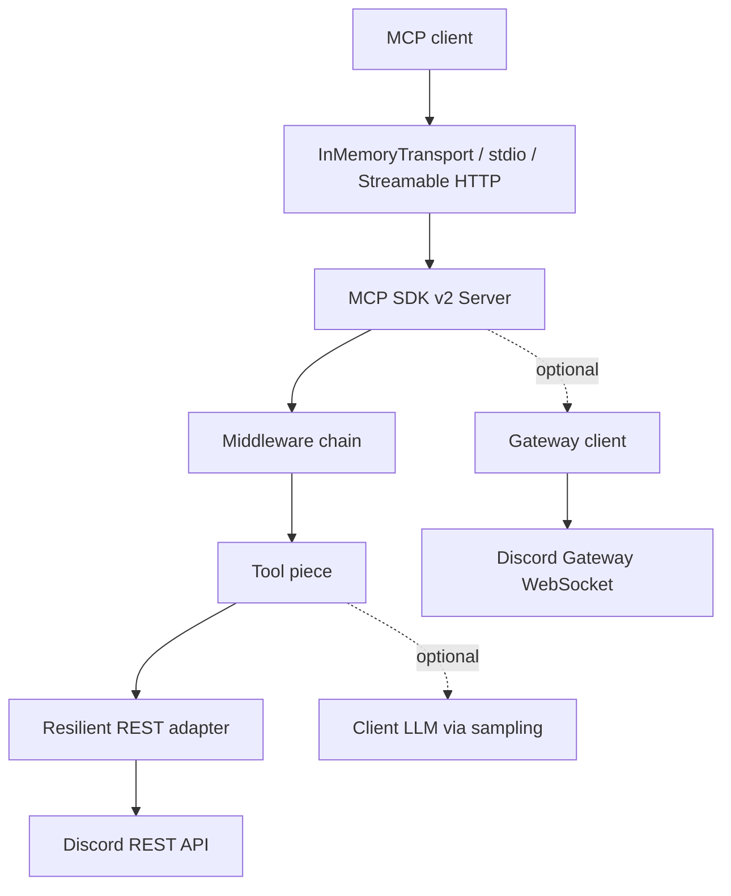

import { Aside } from '@astrojs/starlight/components';
import DocsCardGrid from '../../../components/docs/DocsCardGrid.astro';

Trace a tool call from MCP input to Discord REST. Tools live in a Sapphire-style
registry and pass through six middleware stages: telemetry → default guild →
validation → category gate → preconditions → audit. The REST adapter adds
bulkhead, circuit-breaker, retry, and timeout policies. Optional Gateway mode
emits notifications for five URI keys and falls back to REST-only startup when
the Gateway connection cannot boot.

## System design



- **MCP client** sends JSON-RPC `tools/call` over stdio or Streamable HTTP.
- **Transport** owns JSON-RPC framing; the CLI defaults to `stdio`, `serve
  --http` provides stateless Streamable HTTP, and tests use `InMemoryTransport`.
  The HTTP entry negotiates MCP `2026-07-28` and retains a stateless 2025-era
  compatibility path.
- **MCP SDK v2 Server** bridges MCP to the piece registry and hosts the middleware,
  tool, precondition, and resource stores.
- **Middleware chain** applies telemetry, default guild, validation, category
  gate, preconditions, and audit before execution.
- **Tool piece** implements one of the 205 tools, using Discord REST, MCP
  sampling back to the client for intelligence, or caller-invoked external
  inspiration discovery.
- **REST adapter** wraps `@discordjs/rest` in Cockatiel bulkhead,
  circuit-breaker, retry, and timeout policies.
- **Gateway client** is optional under `--gateway`; it emits notifications for
  five URI keys but does not add resource list/read handlers.

## Registry and repository shape

discord-mcp uses Sapphire's explicit "piece + store" model. `Tool` and
`Precondition` classes are registered by `server.ts`; boot does not scan the
filesystem. The stores provide lookup by name, while the container supplies the
configured REST client, logger, and config to tool pieces.

This keeps tool construction consistent, but registration is intentionally
explicit: adding a tool also requires adding it to `server.ts`.

```
packages/
  mcp-core/                # Tools, middleware, resilience policy
    src/
      tools/               # 205 tool definitions
      middleware/          # 6 stages + compose
      preconditions/       # ConfirmRequired, CategoryEnabled
      pieces/              # Tool and Precondition base classes
      stores/              # Tool/precondition lookup + resources
      rest/                # Cockatiel-wrapped @discordjs/rest
      gateway/             # Optional discord.js client
      pipeline/            # mcp_pipeline executor
      errors/              # Error hierarchy + formatErrorForUser
      audit/               # Audit sinks + redaction
      telemetry/           # OTel boot + metrics
  mcp-server/              # CLI, stdio, and Streamable HTTP transport wiring
```

`mcp-core` has no transport assumptions. `mcp-server` is the thin shell that
wires it to stdio or Streamable HTTP, OpenTelemetry, and signal handling. The
remote HTTP shell uses the SDK v2 per-request handler factory to create a fresh
core runtime per request, so it does not share MCP session state. Its
bearer-token deployment model is documented in
[OpenAI remote MCP](/discord-mcp/operations/openai/).

Sources:
[`server.ts`](https://github.com/cappyeo/discord-mcp/blob/main/packages/mcp-core/src/server.ts),
[`Tool.ts`](https://github.com/cappyeo/discord-mcp/blob/main/packages/mcp-core/src/pieces/Tool.ts),
and [`ToolStore.ts`](https://github.com/cappyeo/discord-mcp/blob/main/packages/mcp-core/src/stores/ToolStore.ts).

<Aside type="note">
The middleware boundary centralizes validation, category restriction,
confirmation, audit, and observability. Tools still need registration and
tests, but do not reimplement those controls.
</Aside>

## Explore a subsystem

<DocsCardGrid
  links={[
    { title: 'Middleware chain', href: '/discord-mcp/architecture/middleware-chain/', description: 'The six stages wrapping every tool call, why their order matters, and which controls run before execution.' },
    { title: 'Components V2', href: '/discord-mcp/architecture/components-v2/', description: 'The V2 layout primitives (Container, Section, MediaGallery, ActionRow), the schema validator, the preview renderer, the 5 templates, and the flags=32768 contract.' },
    { title: 'Pipeline', href: '/discord-mcp/architecture/pipeline/', description: 'The mcp_pipeline executor: sequential fail-fast calls, {{stepN.path}} interpolation, recursion guard, and partial-failure semantics.' },
    { title: 'Gateway', href: '/discord-mcp/architecture/gateway/', description: 'The optional --gateway mode: five notification URI keys, five handlers, in-memory subscriptions, debounce, and REST-only fallback.' },
    { title: 'Error handling', href: '/discord-mcp/architecture/error-handling/', description: 'The error hierarchy (client vs server), formatErrorForUser shape, recovery-hint contract, DRY_RUN_PREVIEW pattern, Cockatiel mappings.' },
    { title: 'Confirmation', href: '/discord-mcp/architecture/confirmation/', description: 'The __confirm:true + MCP_DRY_RUN=false mechanical guard used by 30 explicitly registered high-risk tools-and its limits.' },
    { title: 'Sampling', href: '/discord-mcp/architecture/sampling/', description: 'Zero-API-key intelligence: how the 5 intelligence tools call back into the client’s LLM via MCP sampling, with a graceful host_llm_should_process fallback.' },
    { title: 'Rate limits', href: '/discord-mcp/architecture/rate-limits/', description: 'Discord’s global and route buckets, the @discordjs/rest scheduler, and the boundary with local resilience policies.' },
  ]}
/>

## Choose a path

If you're a **contributor**, start with the system design above, then jump to
the subsystem you're touching. The deep-dive pages each link to source files
via GitHub permalinks so you can read implementation in a tab.

If you're an **operator** trying to understand a production behavior, the
fastest path is usually:

1. Look up the env var or error code on the relevant
   [Operations](/discord-mcp/operations/) page.
2. Follow that page's "Related" links into the architecture deep-dive.
3. Use the source-map table at the bottom of the architecture page to
   find the exact file responsible.

The architecture pages assume familiarity with Discord's API model and
basic TypeScript. We do not re-explain MCP itself - see
[modelcontextprotocol.io](https://modelcontextprotocol.io) for that.

## Related

- [Get started](/discord-mcp/start/) - install and run the server.
- [Tools](/discord-mcp/tools/) - auto-generated reference for all 205 tools.
- [Recipes](/discord-mcp/recipes/) - multi-tool workflows that exercise these subsystems.
- [Operations](/discord-mcp/operations/) - production-running concerns: telemetry, resilience, audit, client matrix.
