import { Aside } from '@astrojs/starlight/components';

Every tool call goes through a multi-stage middleware chain before reaching the
tool's `run` method. The order is fixed and matters: each layer assumes the
ones outside it have already run.

## The chain

```mermaid
graph LR
  A[tools/call] --> B[telemetry]
  B --> C[default guild]
  C --> D[blueprint target]
  D --> E[validate]
  E --> F[guild scope]
  F --> G[category gate]
  G --> H[runtime access]
  H --> I[write mode]
  I --> J[preconditions]
  J --> K[payload approval]
  K --> L[audit]
  L --> M[Tool.run]
```



Read it as a Koa pipeline: each middleware wraps `next()`, runs setup, awaits
the inner chain, runs teardown, and returns. The arrows show the call descending
to the handler; the unwind is implicit in each `await next()`.

The composition primitive is in
[`packages/mcp-core/src/middleware/compose.ts`](https://github.com/cappyeo/discord-mcp/blob/main/packages/mcp-core/src/middleware/compose.ts):
the same Koa-style dispatcher (with the standard "next() called twice" guard).

## Layer 1: telemetry (outermost)

Source: [`middleware/telemetry.ts`](https://github.com/cappyeo/discord-mcp/blob/main/packages/mcp-core/src/middleware/telemetry.ts)

Wraps the entire call in an OTel SERVER span and emits the three tool-level
metrics (`mcp.tool.duration_ms`, `mcp.tool.calls`, `mcp.tool.errors`). Always
fires - even for calls that fail validation or preconditions, because we
want to **see** those failures in dashboards.

Why outermost: a call that gets rejected by validation should still be
counted (so you can spot a buggy agent that's spamming bad inputs). If
validation ran first and rejected before telemetry, you'd lose visibility on
exactly the calls that need monitoring.

## Layer 2: default guild

Source: [`middleware/default-guild.ts`](https://github.com/cappyeo/discord-mcp/blob/main/packages/mcp-core/src/middleware/default-guild.ts)

When `DISCORD_DEFAULT_GUILD_ID` is set, supplies it only if the call omitted a
top-level `guild_id` and the selected tool declares that field. Explicit input
always wins; tools without `guild_id` are unchanged.

Why before validation: the default must be present before a required
`guild_id` schema is parsed.

## Layer 3: blueprint target

Source: [`middleware/blueprint-plan-target.ts`](https://github.com/cappyeo/discord-mcp/blob/main/packages/mcp-core/src/middleware/blueprint-plan-target.ts)

For a blueprint apply or resume, resolves and checks the caller-local plan
reference, locked guild, bot identity, and approval before a mutation can run.
A stale or mismatched plan stops here.

## Layer 4: validate

Source: [`middleware/validate.ts`](https://github.com/cappyeo/discord-mcp/blob/main/packages/mcp-core/src/middleware/validate.ts)

Runs the tool's zod schema against `arguments`. On failure, throws
`ValidationError` with a structured `issues` array (each issue has `path`,
`message`, `code`).

Why before policy gates: if args are invalid, later stages cannot safely inspect them
(e.g. `ConfirmRequired` reads `args.__confirm` - if `args` is the wrong
shape, that read might throw before the validation message ever surfaces).
Validating first means preconditions and the handler both work with a
typed, well-formed payload.

<Aside type="note">
Validation strips unknown keys by default (zod's `.strict()` is opt-in
per-tool). The `__confirm`, `__confirm_hash`, and `__confirm_id` authorization fields are **not**
in individual tool schemas - they are extracted from the raw arg payload **before** zod runs (see
[Confirmation](/discord-mcp/architecture/confirmation/)). This is the one
place the chain reads pre-validation args.
</Aside>

## Layer 5: guild scope

Source: [`middleware/guild-allowlist.ts`](https://github.com/cappyeo/discord-mcp/blob/main/packages/mcp-core/src/middleware/guild-allowlist.ts)

When `ALLOWED_GUILDS` is active, proves the target guild for direct calls,
channels, webhooks, invites, stickers, and pipeline steps. It also keeps
application-emoji operations tied to the locked bot identity. Unresolved scope
fails closed before a Discord request.

## Layer 6: category gate

Source: [`middleware/category.ts`](https://github.com/cappyeo/discord-mcp/blob/main/packages/mcp-core/src/middleware/category.ts)

Enforces the `MCP_CATEGORIES` allowlist for every registered tool. The `meta`
category stays available so `mcp_pipeline` can be called, but each pipeline step
re-enters the dispatcher and is checked against its own category.

Why this is middleware: a new tool cannot accidentally bypass the allowlist by
forgetting to declare a precondition.

## Layer 7: runtime access

Source: [`middleware/runtime-access.ts`](https://github.com/cappyeo/discord-mcp/blob/main/packages/mcp-core/src/middleware/runtime-access.ts)

When `MCP_ACCESS_MODE` is `warn` or `enforce`, the server asks the configured
read-only evidence resolver to verify the locked bot identity, target guild or
channel, effective permission bits, Gateway intent state, and (where declared)
role hierarchy. The built-in stdio and HTTP transports inject a bounded REST
resolver; embedders may provide their own resolver through `BuildServerDeps`.

`advisory` is the compatibility default and does not contact Discord for this
extra gate. `warn` records evidence gaps and continues. `enforce` allows only
complete evidence and fails closed for unknown or partial results. The resolver
never infers access from a tool name and never performs a mutation. Permission
snapshots are short-lived and invalid evidence is not cached.

## Layer 8: write mode

Source: [`middleware/write-preview.ts`](https://github.com/cappyeo/discord-mcp/blob/main/packages/mcp-core/src/middleware/write-preview.ts)

`MCP_WRITE_MODE=preview` blocks every mutating tool, including ordinary writes,
after scope and category checks but before a payload approval is issued or
consumed. Read-only tools continue to the next layer.

## Layer 9: preconditions

Source: [`middleware/precondition.ts`](https://github.com/cappyeo/discord-mcp/blob/main/packages/mcp-core/src/middleware/precondition.ts)

Runs every `Precondition` piece declared by the tool. The store contains two
built-in pieces, but only identifiers in that tool's metadata run:

- **`ConfirmRequired`** ([`preconditions/ConfirmRequired.ts`](https://github.com/cappyeo/discord-mcp/blob/main/packages/mcp-core/src/preconditions/ConfirmRequired.ts))
  - gates destructive tools behind `__confirm:true` + `MCP_DRY_RUN=false`.
- **`CategoryEnabled`** ([`preconditions/CategoryEnabled.ts`](https://github.com/cappyeo/discord-mcp/blob/main/packages/mcp-core/src/preconditions/CategoryEnabled.ts))
  - remains available for embedders; the built-in server applies the category
  gate globally in layer 6.

Preconditions throw structured errors; the handler never runs if any
precondition fails.

Why before audit: a precondition that rejects (for example, missing confirmation) shouldn't
audit the tool body - the tool didn't actually execute.

## Layer 10: payload-bound approval

Source: [`middleware/payload-confirmation.ts`](https://github.com/cappyeo/discord-mcp/blob/main/packages/mcp-core/src/middleware/payload-confirmation.ts)

`components_v2_send`, `components_v2_edit`, and
`components_v2_send_from_template` are validated at this narrow seam,
classified for mentions, URLs, and interactive controls, and fingerprinted
with canonical SHA-256. The first call returns a redacted preview and
`payload_hash`; only `MCP_DRY_RUN=false`, `__confirm:true`, and the exact
`__confirm_hash` plus the unconsumed `__confirm_id` reach the handler. A changed
payload, expired approval, or replay fails closed. This stage intentionally
runs after write mode and ordinary preconditions, so a blocked call cannot
consume an approval that was never eligible to reach the handler.

## Layer 11: audit (innermost)

Source: [`middleware/audit.ts`](https://github.com/cappyeo/discord-mcp/blob/main/packages/mcp-core/src/middleware/audit.ts)

Captures the redacted args, the result (success / `tool_error` / thrown), the
duration, and the OTel trace/span IDs (if active). Emits **once per call** to
the configured sink for every non-read-only tool. Explicitly read-only calls
are skipped; idempotent writes remain auditable.

Why innermost: audit is meaningful only for actually-attempted operations.
A call rejected by validation or preconditions never reaches the handler;
auditing it would log non-events and balloon the trail.

## Why this order

The mental model is **outermost = most universal, innermost = most
specific**:

| Stage | Sees | Stops or skips on |
| ----- | ---- | ----------------- |
| Telemetry | every call | nothing - always observes |
| Default guild | raw call plus selected tool schema | no matching field/default |
| Blueprint target | apply/resume calls | stale or mismatched plan |
| Validate | defaulted arguments | malformed args |
| Guild scope | validated calls | target outside allowlist or unresolved scope |
| Category gate | validated, scope-checked calls | disallowed category |
| Runtime access | validated, category-allowed calls | missing, partial, or denied bot evidence in `enforce` mode |
| Write mode | mutating calls | `MCP_WRITE_MODE=preview` |
| Preconditions | valid, policy-allowed calls | confirmation or custom policy rejection |
| Payload approval | Components V2 writes | missing or stale payload approval |
| Audit | calls that passed every earlier stage | skips only explicit `readOnlyHint: true` tools |

Each inner stage assumes the outer guarantees: audit receives a valid,
category-allowed call; preconditions receive parsed args; validation receives
any configured default guild.

Reversing the order breaks each guarantee in a subtle way - e.g. moving
audit outside preconditions means logging "would have audited" events that
never executed, which is worse than silence for compliance review.

## Per-call context

Each layer receives a `MiddlewareContext`:

```ts
interface MiddlewareContext<Args = unknown> {
  readonly tool: { name: string; category: string; idempotent: boolean };
  readonly args: Args;
  readonly meta: Map<string, unknown>;
  readonly signal?: AbortSignal;
}
```

`meta` is the bag for cross-layer state (e.g. telemetry stashes the active
span; audit reads it to attach `trace_id`/`span_id`). Layers communicate via
this map rather than monkey-patching the context - keeps the type contract
clean.

## Adding a stage

Place a new policy stage **before audit** if rejection means the tool never
executed. Its exact position depends on whether it needs raw, defaulted, or
validated arguments; cover that ordering decision with a dispatcher-level test.

## Related

- [Operations → Telemetry](/discord-mcp/operations/telemetry/) - the metrics emitted by layer 1.
- [Operations → Audit](/discord-mcp/operations/audit/) - the AuditEvent schema emitted by layer 10.
- [Architecture → Confirmation](/discord-mcp/architecture/confirmation/) - the confirmation behavior in layers 9-10.
- [Architecture → Error handling](/discord-mcp/architecture/error-handling/) - how layer-thrown errors surface to the client.
