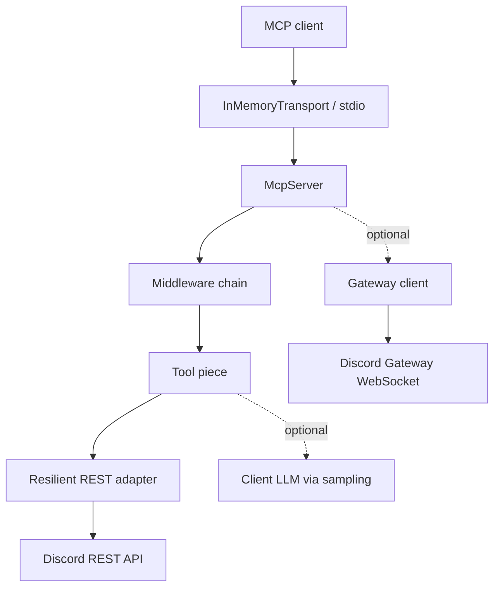

import { Aside } from '@astrojs/starlight/components';

discord-mcp is a layered server: a Sapphire-style **piece registry** owns the
192 tools, a Koa-style **middleware chain** wraps every call with cross-cutting
concerns, a **resilient REST adapter** sits between the tools and Discord's
HTTP API, and an **audit + telemetry** layer observes the whole thing. This
page is the map; the rest of the Architecture section is the detail.

## The call path



What each box does:

- **MCP client** — Claude Desktop, Claude Code, Cursor, or any spec-compliant
  client. Sends JSON-RPC `tools/call` over stdio.
- **Transport** — `stdio` in production; `InMemoryTransport` in tests. Owns
  the JSON-RPC framing; never sees tool arguments.
- **McpServer** — the bridge between MCP protocol and the piece registry.
  Hosts middleware, tool, precondition, and resource stores.
- **Middleware chain** — six stages (telemetry, default guild, validation,
  category gate, preconditions, audit) that wrap every call. See
  [Middleware chain](/discord-mcp/architecture/middleware-chain/).
- **Tool piece** — one of the 192 tool implementations. Calls Discord via the
  REST adapter or (rarely) calls the client back via sampling.
- **REST adapter** — wraps `@discordjs/rest` in Cockatiel resilience policies.
  See [Operations → Resilience](/discord-mcp/operations/resilience/) and
  [Architecture → Rate limits](/discord-mcp/architecture/rate-limits/).
- **Gateway client** (optional) — `discord.js` lazy-loaded when the
  `--gateway` flag is set. Emits update notifications for five URI keys; it
  does not add resource list/read handlers. See
  [Architecture → Gateway](/discord-mcp/architecture/gateway/).

## The piece model (Sapphire-inspired)

discord-mcp borrows the Sapphire framework's "piece + store" model:

- **Pieces** are the registration unit for `Tool` and `Precondition` classes.
  `server.ts` explicitly imports and loads the 192 tool classes; boot does not
  scan the filesystem.
- **Stores** provide lookup by name. `ToolStore` and `PreconditionStore` use
  Sapphire stores; `ResourceStore` is a plain adapter around the static
  Components V2 list/read functions.
- **Container** exposes the configured REST client, logger, and config to tool
  pieces without threading those dependencies through every handler.

This keeps tool construction consistent, but registration is intentionally
explicit: adding a tool also requires adding it to `server.ts`.

Source:
[`packages/mcp-core/src/server.ts`](https://github.com/cappyeo/discord-mcp/blob/main/packages/mcp-core/src/server.ts),
[`pieces/Tool.ts`](https://github.com/cappyeo/discord-mcp/blob/main/packages/mcp-core/src/pieces/Tool.ts),
[`stores/ToolStore.ts`](https://github.com/cappyeo/discord-mcp/blob/main/packages/mcp-core/src/stores/ToolStore.ts).

## What's where in the repo

```
packages/
  mcp-core/                # All tool definitions, middleware, resilience policy
    src/
      tools/               # 192 tools across ~20 categories
      middleware/          # 6 middleware stages + compose
      preconditions/       # ConfirmRequired, CategoryEnabled
      pieces/              # Base classes for Tool and Precondition
      stores/              # Tool/precondition lookup + static resource adapter
      rest/                # Cockatiel-wrapped @discordjs/rest
      gateway/             # discord.js gateway client (optional)
      pipeline/            # mcp_pipeline executor + interpolation
      errors/              # Error hierarchy + formatErrorForUser
      audit/               # Audit middleware + sinks + redaction
      telemetry/           # OTel SDK boot + custom metrics
  mcp-server/              # Thin CLI + stdio transport wiring
    src/
      transports/          # stdio, future http
      otel.ts              # OTel SDK lifecycle
```

`mcp-core` has no transport assumptions — it's a library that anything could
host. `mcp-server` is the thin shell that wires it to stdio + OTel + signal
handling.

## Why this shape

<Aside type="note">
The middleware boundary centralizes validation, category restriction,
confirmation, audit, and observability. A tool still needs registration and
tests, but it does not reimplement those cross-cutting controls.
</Aside>

The pieces below split the inheritance into explainable units:

- [Middleware chain](/discord-mcp/architecture/middleware-chain/) — the six
  stages and why their order matters.
- [Components V2](/discord-mcp/architecture/components-v2/) — the rich layout
  primitives and their schema validator.
- [Pipeline](/discord-mcp/architecture/pipeline/) — sequential fail-fast multi-tool calls with no rollback.
- [Sampling](/discord-mcp/architecture/sampling/) — the zero-API-key
  intelligence path.
- [Rate limits](/discord-mcp/architecture/rate-limits/) — Discord's quota
  model, our retry/bulkhead response.
- [Gateway](/discord-mcp/architecture/gateway/) — optional WebSocket update
  notifications and current protocol limitations.
- [Error handling](/discord-mcp/architecture/error-handling/) — error
  hierarchy, recovery hints, Cockatiel mapping.
- [Confirmation](/discord-mcp/architecture/confirmation/) — the
  `__confirm:true` + `MCP_DRY_RUN=false` contract.
