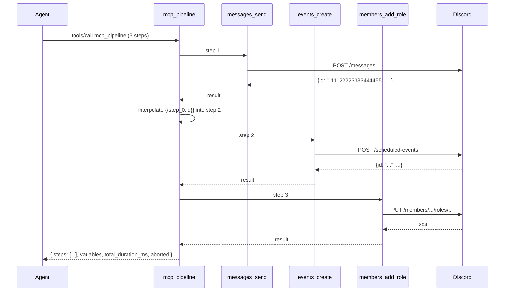

import { Aside } from '@astrojs/starlight/components';

# Pipeline

`mcp_pipeline` is the meta-tool that executes **N tool calls in a single MCP
request**, with later steps referring to earlier results via interpolation
syntax. It exists because some workflows are atomic in intent but require
multiple Discord REST calls — e.g. "post the announcement, schedule the
event, grant the role, all or nothing." Without a pipeline, the agent makes
three round-trips and has to handle partial failures itself; with one, the
server captures intermediate state and propagates failures cleanly.

## The flow



Sequential by default. Each step can read **any earlier step's output** via
the `{{step_id.path}}` syntax; later steps see the resolved values.

See [`pipeline-multistep` recipe](/discord-mcp/recipes/pipeline-multistep/)
for a worked example.

## Variable interpolation

Source: [`packages/mcp-core/src/pipeline/interpolate.ts`](https://github.com/cappyeo/discord-mcp/blob/main/packages/mcp-core/src/pipeline/interpolate.ts)

Every step has an **id**. Give it one explicitly with `"id": "announce"`, and
reference it as `{{announce.field}}`. If you omit `id`, the executor assigns
`step_<index>` using a **0-based** index — the first step is `step_0`, the
second `step_1`.

<Aside type="caution">
There is no `step1`. A template like `{{step1.field}}` resolves to nothing
and, because it is a whole-string template, the arg becomes `undefined` —
which is then sent to Discord (or dropped by the tool's zod schema). Name your
steps explicitly; it is the only readable way to write a pipeline.
</Aside>

Syntax:

- `{{announce.field}}` — read a field on the step whose id is `announce`.
- `{{announce.field.subfield}}` — dotted path traversal.
- `{{announce.array[0]}}` — bracket index for arrays.
- `{{announce.array[0].id}}` — combine.
- `save_as: "alias"` on a step also publishes its result under `alias`.

Resolution happens at **dispatch time** for each step: the args are walked
recursively and every string is scanned for `{{...}}`.

Unresolvable paths do **not** raise and do **not** abort. Two behaviors,
depending on the shape of the string:

- **Whole-string template** (`"{{missing.path}}"`) — the arg becomes
  `undefined`.
- **Embedded template** (`"see {{missing.path}} now"`) — the literal
  `{{missing.path}}` text is left in place.

Either way the step still runs, so a typo'd path surfaces as a downstream
validation error or as literal braces posted into Discord — not as an
interpolation error.

Resolved values keep their type — `{{announce.count}}` evaluating to a number
yields a real number in the next step's args, not the string `"42"`, as long
as the template is the whole string.

## Recursion guard

<Aside type="caution">
**Pipelines cannot call pipelines.** A `mcp_pipeline` step that invokes
`mcp_pipeline` is detected at dispatch and rejected with the
`PIPELINE_RECURSION` error code. The reason: nested pipelines would multiply
the bulkhead pressure (see [Operations → Resilience](/discord-mcp/operations/resilience/))
and make state hand-off ambiguous (which step counter does the inner one
share?).
</Aside>

If you find yourself wanting nested pipelines, the right answer is to
flatten: write one pipeline whose steps **happen to be** what the inner
would have run. The interpolation syntax is powerful enough to express most
nested-pipeline shapes as a flat sequence.

## Why it exists

Three reasons:

1. **Atomic intent**: "announce + schedule + grant" is one operator action,
   not three. Capturing it as one MCP call gives the agent a clean
   success/failure contract instead of three independent round-trips with
   their own error states.

2. **Single observability unit**: one pipeline = one parent span (with N
   child spans) in OTel. Audit emits **one event per leaf**, but the parent
   span correlates them so you can reconstruct the workflow trivially.

3. **Captured intermediate state**: `announce.message_id` gets passed into step 2
   without the agent ever seeing it. Reduces token usage on the agent side
   (no need to round-trip "what's the message ID? OK now use it") and
   eliminates whole classes of "agent dropped a snowflake mid-prompt"
   bugs.

## Failure behavior

Two failure modes:

- **Mid-pipeline**: step N fails (validation, precondition, REST error).
  The pipeline records the error on that step in the `steps` array, sets
  `aborted: true`, and **breaks** — subsequent steps are never dispatched and
  never appear in `steps` at all. Earlier steps' Discord side effects already
  happened; the `steps` array tells you exactly what completed. Set
  `continue_on_error: true` on a step to keep going past its failure instead.
- **Bulkhead saturation**: if a leaf fails with `bulkhead_saturated`, the
  pipeline propagates it. There is no automatic retry of the saturated
  step inside the pipeline (cockatiel's retry already ran for that step).

Interpolation is not a failure mode — see
[Variable interpolation](#variable-interpolation) for what an unresolvable
path does instead.

The result envelope shape:

```json
{
  "steps": [
    { "id": "announce", "tool": "messages_send", "status": "success", "result": { "...": "..." }, "duration_ms": 142 },
    { "id": "event", "tool": "events_create", "status": "error", "error": { "code": "DISCORD_PERMISSION", "message": "...", "retriable": false }, "duration_ms": 88 }
  ],
  "variables": { "announce": { "...": "..." } },
  "total_duration_ms": 230,
  "aborted": true
}
```

Per-step `status` is `"success"`, `"error"`, or `"skipped"` (an `if` condition
that evaluated falsy). `result` is present only on success, `error` only on
error. `variables` is the interpolation namespace at completion — successful
steps only.

To decide whether to retry / surface to the human, branch on:

```js
const failed = result.aborted === true
  || result.steps.some((s) => s.status === 'error');
```

<Aside type="caution">
There is no `summary` object and no `ok` field on a step. Code that branches
on `summary.failed > 0` reads `undefined > 0`, which is `false`, so **every
pipeline — including one that aborted on its first step — looks successful.**
Use `aborted` or scan `steps` for `status === 'error'`.
</Aside>

## Source map

| Concern | File |
| ------- | ---- |
| Tool definition | [`tools/meta/pipeline.ts`](https://github.com/cappyeo/discord-mcp/blob/main/packages/mcp-core/src/tools/meta/pipeline.ts) |
| Sequential executor | [`pipeline/executor.ts`](https://github.com/cappyeo/discord-mcp/blob/main/packages/mcp-core/src/pipeline/executor.ts) |
| Variable interpolation | [`pipeline/interpolate.ts`](https://github.com/cappyeo/discord-mcp/blob/main/packages/mcp-core/src/pipeline/interpolate.ts) |

## Related

- [`pipeline-multistep` recipe](/discord-mcp/recipes/pipeline-multistep/) — worked example with three real tool calls.
- [Operations → Resilience](/discord-mcp/operations/resilience/) — the bulkhead is shared across pipeline children, not amplified.
- [Architecture → Components V2](/discord-mcp/architecture/components-v2/) — common pipeline destination is `components_v2_send`.
